# online-ordering-system

# 요구사항 명세서 (원본)

온라인 주문 시스템 구축(OOS, Online Ordering System)

- 메뉴 신규 등록 / 삭제 - 피주문자
  - 신규 메뉴 등록
  - 기존 메뉴 삭제
  - 피주문자-금일 추천 메뉴 스위치(추천 or 기본)
- 메뉴 리스트 출력 조회 - 주문자
  - 개별 메뉴별 평점 및 리뷰 보기
  - 메뉴 리스트 정렬(추천/평점/주문수/최신)
- 메뉴 선택주문-주문자
  - 선택메뉴 정보, 전화번호, 주소, 수량, 결제정보
  - 추가 주문 및 주문내역 변경 - 주문자
    - 추가시 상태가 배달중 일 경우 실패 알림(신규주문으로 전환 알림)
    - 변경시 상태가 조리중, 배달중 일 경우 실패 알림
- 주문 내역 조회-주문자 or 피주문자
  - 과거 이전 주문 내역 조회
- 주문 상태 조회
  - 상태 : 접수중/접수취소/접수-조리중/배달중/배달완료
  - 주문자 주문상태 조회
  - 피주문자-최신 접수내역 확인 및 상태 업데이트(접수중 → 접수 or 접수취소 → 조리중 → 배달중)
- 평점 및 리뷰 남기기-고객
  - 상태가 배달중 or 배달완료 일때만 업데이트 가능
  - 평점 및 리뷰작성 완료시 과거 주문내역으로 업데이트

# 다이어그램

# 요구사항 원본을 통해 내가 이해한 요구사항

## 메뉴 등록/삭제

- 신규 메뉴 등록
- 기존 메뉴 삭제
- 메뉴 조회 기능
- 피주문자-금일 추천메뉴 스위치 (추천 버튼 or 기본버튼) -> 메뉴제공자가 추천할 메뉴를 고를 수 있게하는 스위치 기능

# 메뉴 리스트 출력 조회 - 주문자

- 개별 메뉴별 평점 보기 - 5점 만점
- 개별 메뉴별 리뷰 보기 - 리뷰 글
- 메뉴 리스트 필터링 정렬 (추천/평점/주문수/최신)

# 메뉴 선택주문-주문자

- 선택메뉴 정보, 전화번호, 주소, 수량, 결제정보를 표시해야함
- 추가 주문 및 주문내역 변경 - 주문자
  - 추가시 상태가 배달 중일 경우 실패 알림 (신규주문으로 전환하라고 알림)
  - 변경시 상태가 조리 중, 배달 중 일 경우 실패 알람

# 주문 내역 조회 - 주문자 / 주문 내역 조회 - 피주문자

- 과거 이전 주문 내역 조회 - 주문자용
- 과거 이전 주문 내역 조회 - 피주문자용

# 주문 상태 조회

- 상태 : 접수중/접수취소/접수-조리중/배달중/배달완료
- 주문자입장에서의 주문상태 조회
- 피주문자의 최신 접수내역 확인 및 상태 업데이트 다음과 같이 진행한다.
  접수중 > [접수/접수취소] > 조리 중 > 배달 중

# 평점 및 리뷰 남기기 - 고객

- 상태가 배달 중 or 배달완료일때만 업데이트 가능함
- 평점 및 리뷰작성 완료시 과거 주문내역으로 업데이트 넣기

# API

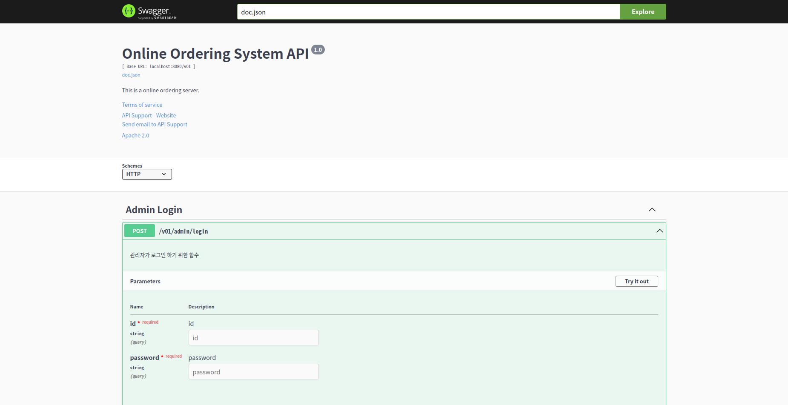
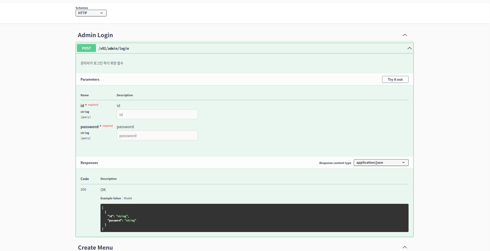
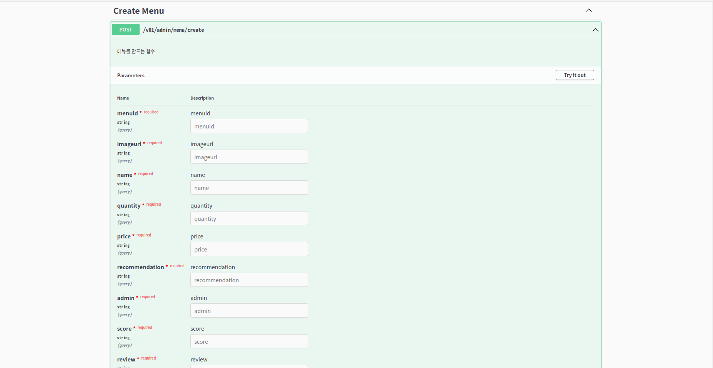
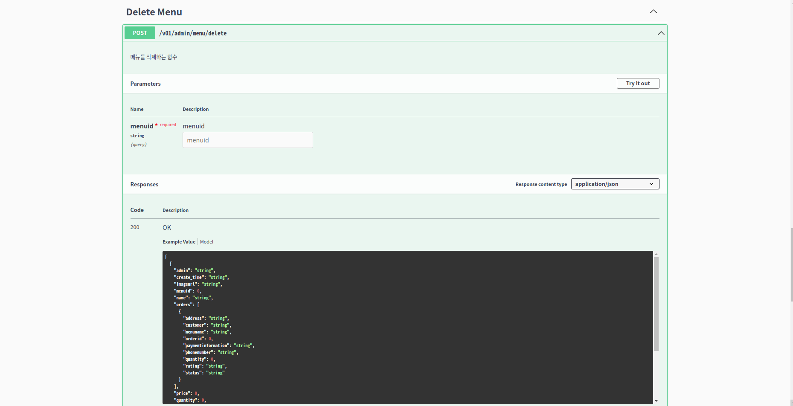
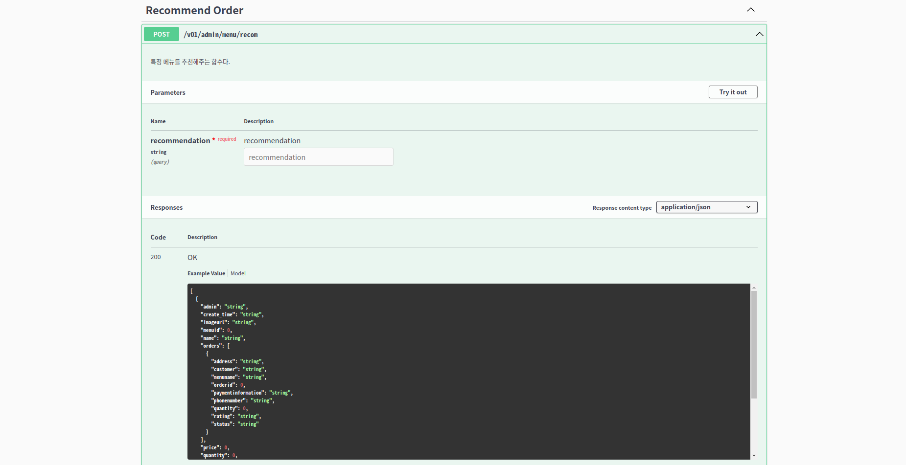
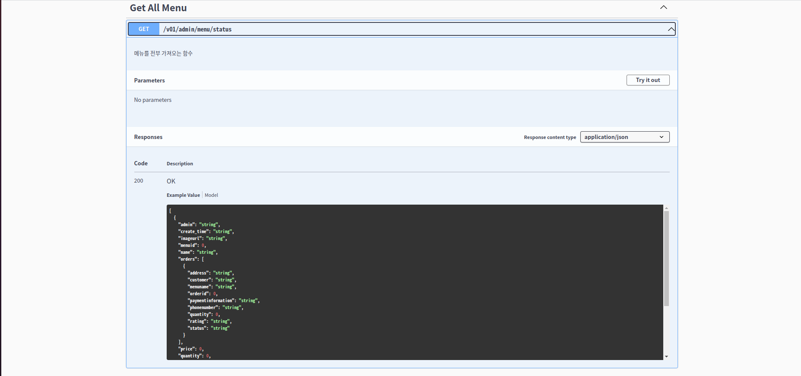
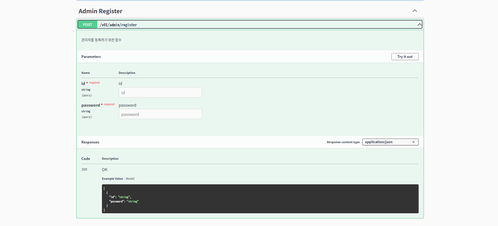
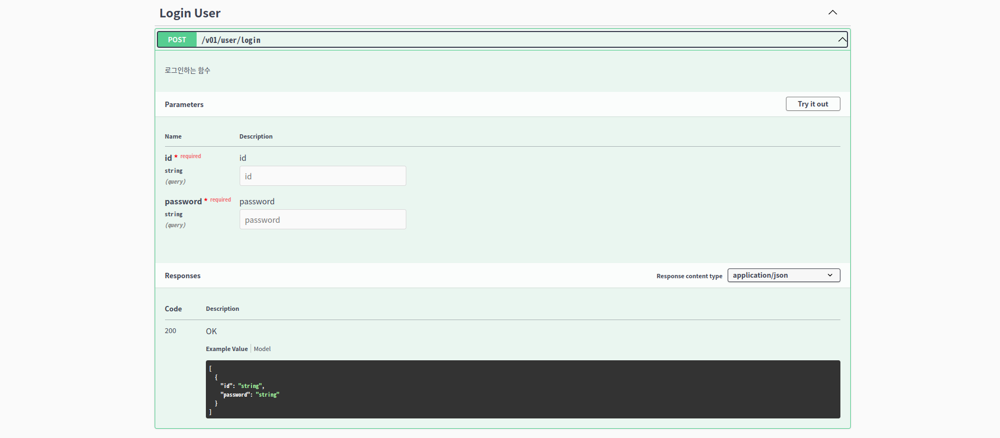
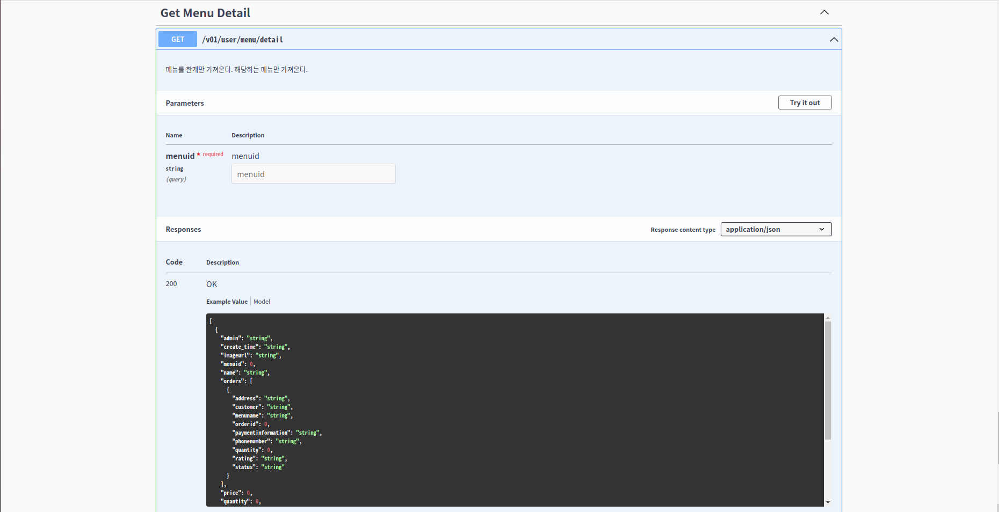
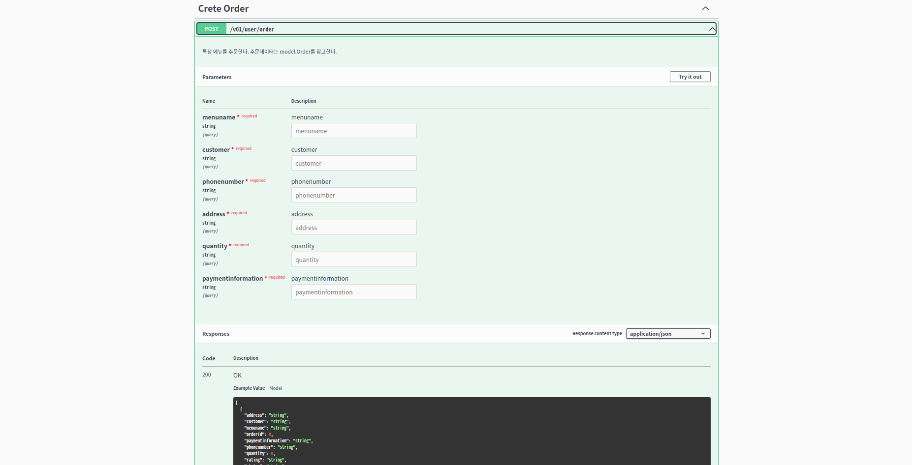
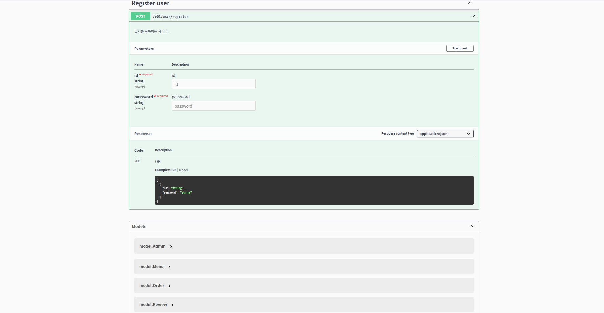
