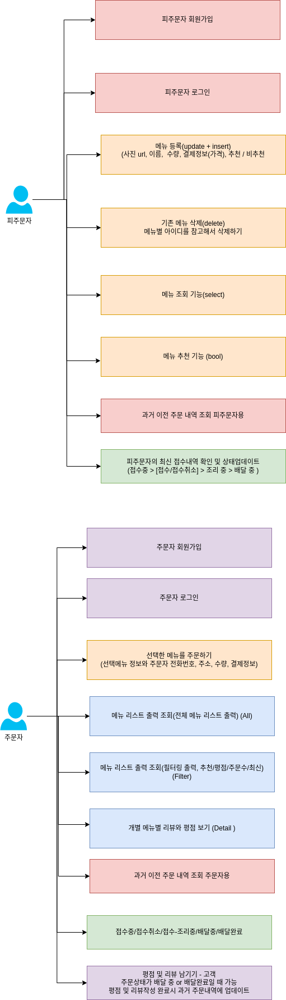

# online-ordering-system

# 요구사항 명세서 (원본)

온라인 주문 시스템 구축(OOS, Online Ordering System)

- 메뉴 신규 등록 / 삭제 - 피주문자
  - 신규 메뉴 등록
  - 기존 메뉴 삭제
  - 피주문자-금일 추천 메뉴 스위치(추천 or 기본)
- 메뉴 리스트 출력 조회 - 주문자
  - 개별 메뉴별 평점 및 리뷰 보기
  - 메뉴 리스트 정렬(추천/평점/주문수/최신)
- 메뉴 선택주문-주문자
  - 선택메뉴 정보, 전화번호, 주소, 수량, 결제정보
  - 추가 주문 및 주문내역 변경 - 주문자
    - 추가시 상태가 배달중 일 경우 실패 알림(신규주문으로 전환 알림)
    - 변경시 상태가 조리중, 배달중 일 경우 실패 알림
- 주문 내역 조회-주문자 or 피주문자
  - 과거 이전 주문 내역 조회
- 주문 상태 조회
  - 상태 : 접수중/접수취소/접수-조리중/배달중/배달완료
  - 주문자 주문상태 조회
  - 피주문자-최신 접수내역 확인 및 상태 업데이트(접수중 → 접수 or 접수취소 → 조리중 → 배달중)
- 평점 및 리뷰 남기기-고객
  - 상태가 배달중 or 배달완료 일때만 업데이트 가능
  - 평점 및 리뷰작성 완료시 과거 주문내역으로 업데이트

# 다이어그램

# 요구사항 원본을 통해 내가 이해한 요구사항

## 메뉴 등록/삭제

- 신규 메뉴 등록
- 기존 메뉴 삭제
- 메뉴 조회 기능
- 피주문자-금일 추천메뉴 스위치 (추천 버튼 or 기본버튼) -> 메뉴제공자가 추천할 메뉴를 고를 수 있게하는 스위치 기능

# 메뉴 리스트 출력 조회 - 주문자

- 개별 메뉴별 평점 보기 - 5점 만점
- 개별 메뉴별 리뷰 보기 - 리뷰 글
- 메뉴 리스트 필터링 정렬 (추천/평점/주문수/최신)

# 메뉴 선택주문-주문자

- 선택메뉴 정보, 전화번호, 주소, 수량, 결제정보를 표시해야함
- 추가 주문 및 주문내역 변경 - 주문자
  - 추가시 상태가 배달 중일 경우 실패 알림 (신규주문으로 전환하라고 알림)
  - 변경시 상태가 조리 중, 배달 중 일 경우 실패 알람

# 주문 내역 조회 - 주문자 / 주문 내역 조회 - 피주문자

- 과거 이전 주문 내역 조회 - 주문자용
- 과거 이전 주문 내역 조회 - 피주문자용

# 주문 상태 조회

- 상태 : 접수중/접수취소/접수-조리중/배달중/배달완료
- 주문자입장에서의 주문상태 조회
- 피주문자의 최신 접수내역 확인 및 상태 업데이트 다음과 같이 진행한다.
  접수중 > [접수/접수취소] > 조리 중 > 배달 중

# 평점 및 리뷰 남기기 - 고객

- 상태가 배달 중 or 배달완료일때만 업데이트 가능함
- 평점 및 리뷰작성 완료시 과거 주문내역으로 업데이트 넣기

# API

### 피주문자

- 피주문자 회원가입

  - http://localhost:8080/admin/v01/register | POST | CREATE

- 피주문자 로그인

  - http://localhost:8080/admin/v01/login | POST | UPDATE

- 피 주문자가 메뉴를 등록한다.

  - http://localhost:8080/admin/v01/menu/create | POST | CREATE
    입력 값은 사진url(string), 메뉴이름(string), 수량(int), 가격(int), 추천/비추천(true/false)

- 피 주문자가 기존 메뉴를 삭제한다.

  - http://localhost:8080/admin/v01/menu/delete | POST | DELETE
    입력값은 메뉴별 아이디다.

- 피주문자의 최신 접수내역을 확인하고 상태를 가져온다.

  - http://localhost:8080/admin/v01/menu/status | GET | SELECT

- 피주문자가 메뉴를 추천/비추천 할 수 있도록 업데이트 한다.
  - http://localhost:8080/admin/v01/menu/recom| POST | UPDATE

### 주문자

- 주문자 회원가입

  - http://localhost:8080/v01/register | POST | CREATE
    -> 입력값은 아이디, 비번이다.

- 주문자 로그인

  - http://localhost:8080/v01/login | POST | UPDATE
    -> 입력값은 아이디, 비번이다.

- 주문자 메뉴 주문

  - http://localhost:8080/v01/order | POST | Create
    -> 선택한 메뉴를 주문하기 (선택메뉴 정보와 주문자 정보 + 전화번호, 주소, 메뉴수량, 결제정보(현금,카드,네이버페이,카카오페이?))
    -> 대신 메뉴 추가시 상태가 배달중일 경우 실패, 신규주문으로 전환알림
    -> 메뉴 변경시 상태가 조리중, 배달중일 경우 실패알림  
    -> Order Status 보고 조건에 따라 진행

- 주문자가 특정 메뉴에 대해 리뷰를 남긴다. > 대신 상태가 배달 중 or 배달완료일때만 업데이트 가능
  - http://localhost:8080/v01/menu/review | POST | UPDATE + INSTERT

### 공통

- 피 주문자,주문자가 전체 메뉴를 조회한다.

  - http://localhost:8080/v01/menu/all | GET | SELECT

- 피 주문자,주문자가 추천으로 필터링해서 메뉴를 조회한다.

  - http://localhost:8080/v01/menu/filter/recom | GET | SELECT

- 피 주문자,주문자가 평점으로 필터링해서 메뉴를 조회한다.

  - http://localhost:8080/v01/menu/filter/rate | GET | SELECT

- 피 주문자,주문자가 주문수로 필터링해서 메뉴를 조회한다.

  - http://localhost:8080/v01/menu/filter/count | GET | SELECT

- 피 주문자,주문자가 최신날짜기준으로 필터링해서 메뉴를 조회한다.

  - http://localhost:8080/v01/menu/filter/latest | GET | SELECT

- 피 주문자,주문자가 특정 메뉴를 조회한다.

  - http://localhost:8080/v01/menu/1 | GET | SELECT

- 피 주문자,주문자가 주문내역을 조회한다.

  - http://localhost:8080/v01/order/history | GET | SELECT

- 피 주문자,주문자가 주문상태를 조회한다.
  - http://localhost:8080/v01/order/status | GET | SELECT

# DB

### 메뉴

Database : mini-oss

#### Collection menu

type Menu struct {
MenuId int `json:"menuid"`
ImageUrl string `json:"imageurl"`
Name string `json:"name"`
Quantity int `json:"quantity"`
Price int `json:"price"`
Recommendation bool `json:"recommendation"`
Admin string `json:"admin"`
Score int `json:"score"`
Review string `json:"review"`
}

### 주문

#### Collection order

type Order struct {
MenuName string `json:"menuname"`
Customer string `json:"customer"`
PhoneNumber string `json:"phonenumber"`
Address string `json:"address"`
Quantity int `json:"quantity"`
PaymentInformation string `json:"paymentinformation"`
}

### 주문상태 - 주문자용 + 피주문자용

#### Collection order_status

- intake / true or false #주문 or 주문 취소
- cooking / true or false # 조리 중
- delivering / true of false # 배달 중
- complete / true or false #배달완료
- user string #주문자

#### Collection review_rating

- rating int #평점
- review string #리뷰작성

#### Collection user_account

- user string
- password string

#### Collection admin_account

- user string
- password string
